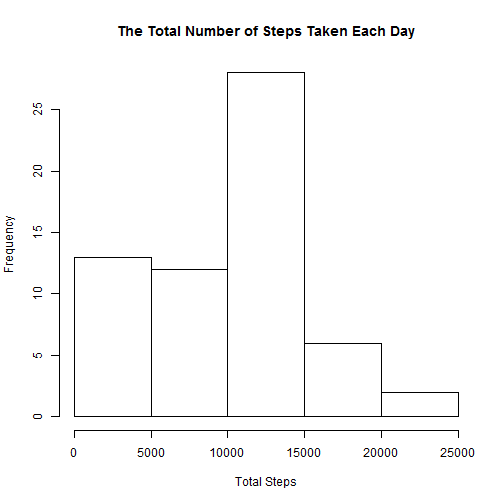
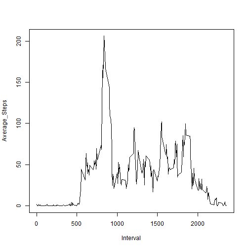
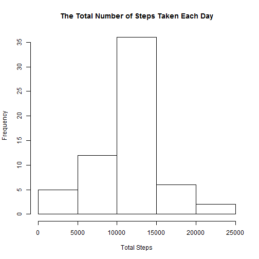
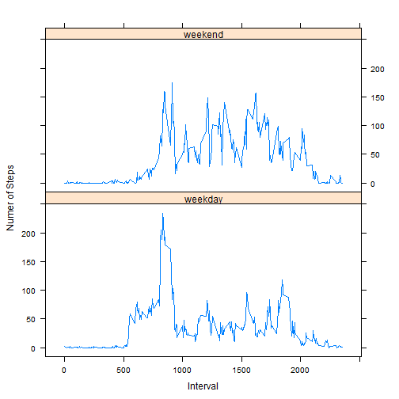

## Loading and preprocessing the data

```r
#Load the data from the file
data <- read.csv("activity.csv")
#Process the data into a format suitable for the analysis
data$date <- as.Date(data$date, format = "%Y-%m-%d")
```

## What is mean total number of steps taken per day?

```r
#Total number of steps taken per day
steps_sum_by_day <- sapply(split(data$steps,data$date),sum,na.rm = TRUE)

#A histogram of the total number of steps taken each day
hist(steps_sum_by_day,main = "The Total Number of Steps Taken Each Day", xlab = "Total Steps")
```

 

```r
#Calculate the mean total number of steps taken per day
mean(steps_sum_by_day)
```

```
## [1] 9354.23
```

```r
#Claculate the median total number of steps taken per day
median(steps_sum_by_day)
```

```
## [1] 10395
```


## What is the average daily activity pattern?

```r
Average_Steps <- sapply(split(data$steps,data$interval),mean,na.rm = TRUE)
Interval <- data$interval[1:length(Average_Steps)]
plot(Interval, Average_Steps,type = "l")
```

 

```r
#The maximum number of steps
max(Average_Steps)
```

```
## [1] 206.1698
```

```r
#Which 5-minute interval, on average across all the days in #the dataset, contains the maximum number of steps
Interval[which.max(Average_Steps)]
```

```
## [1] 835
```


## Imputing missing values

```r
#The total number of missing values in the dataset
length(data$steps[data$steps == NA])
```

```
## [1] 17568
```

```r
temp <- data.frame(Average_Steps,Interval)
Data2 <- data
n <- which(is.na(Data2$steps))
Average_Steps_Extend <- rep(Average_Steps,length(data$steps)/length(Average_Steps))
Data2$steps[n] <- Average_Steps_Extend[n]

steps_sum_by_day2 <- sapply(split(Data2$steps,Data2$date),sum,na.rm = FALSE)
#A histogram of the total number of steps taken each day
hist(steps_sum_by_day2, breaks = 7, 
     main = "The Total Number of Steps Taken Each Day", 
     xlim = c(0,25000), 
     xlab = "Total Steps")
```

 

```r
#Calculate the mean total number of steps taken per day
mean(steps_sum_by_day2)
```

```
## [1] 10766.19
```

```r
#Claculate the median total number of steps taken per day
median(steps_sum_by_day2)
```

```
## [1] 10766.19
```

```r
#These values differ from the estimates from the first part of the assignment
#The mean is larger then the mean from the first part of the assignment
#the median is larger then the median from the first part of the assignment
```


## Are there differences in activity patterns between weekdays and weekends?

```r
#Create a new factor variable in the dataset with two levels -- "weekday" and "weekend" 
#indicating whether a given date is a weekday or weekend day.
data$day <- julian(data$date)%%7
data_weekday <- subset(data,(data$day != 2) & (data$day != 3))
data_weekend <- subset(data,(data$day == 2) | (data$day == 3))

Average_Steps_wday <- sapply(split(data_weekday$steps,data_weekday$interval),mean,na.rm = TRUE)
Average_Steps_wend <- sapply(split(data_weekend$steps,data_weekend$interval),mean,na.rm = TRUE)

#put the data we're going to use in two separate data frames
frame1 <- data.frame(steps = Average_Steps_wday, interval = Interval, day = "weekday")
frame2 <- data.frame(steps = Average_Steps_wend, interval = Interval, day = "weekend")

#Make a panel plot containing a time series plot
library(lattice)
new_frame = rbind(frame1,frame2)
xyplot(steps~interval|day,data = new_frame,
       layout = c(1,2),type = "l",
       ylab = "Numer of Steps",
       xlab = "Interval")
```

 
